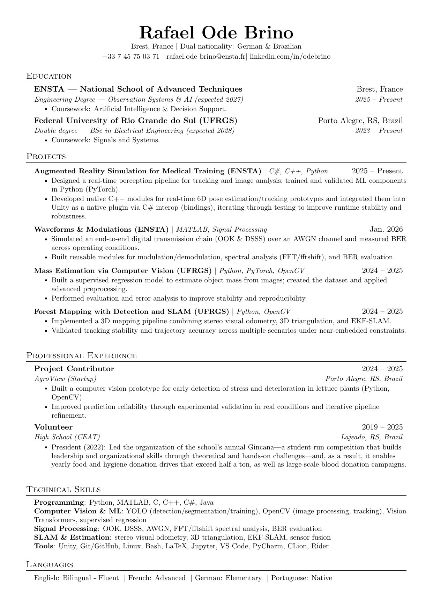

# CV - Rafael Ode Brino

LaTeX resume based on the Jake Gutierrez template.

## PDF

[Download the latest PDF](CV-Rafael_Ode_Brino.pdf)



## Build (local)

```sh
latexmk -pdf -interaction=nonstopmode -file-line-error CV-Rafael_Ode_Brino.tex
```

If you prefer `pdflatex`:

```sh
pdflatex CV-Rafael_Ode_Brino.tex
```

## Notes

- The PDF is tracked in this repository for convenience.
- This repo keeps the LaTeX source and supporting files as the source of truth.
- GitHub Actions builds the PDF on every push and pull request.

## License

MIT. See `LICENSE`.
